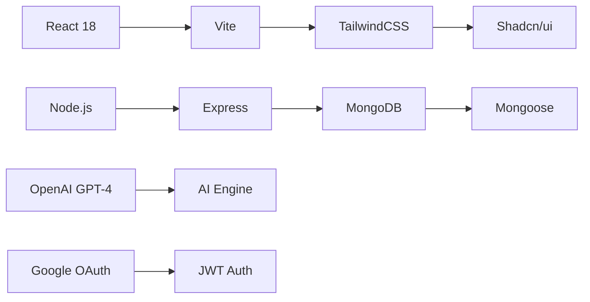
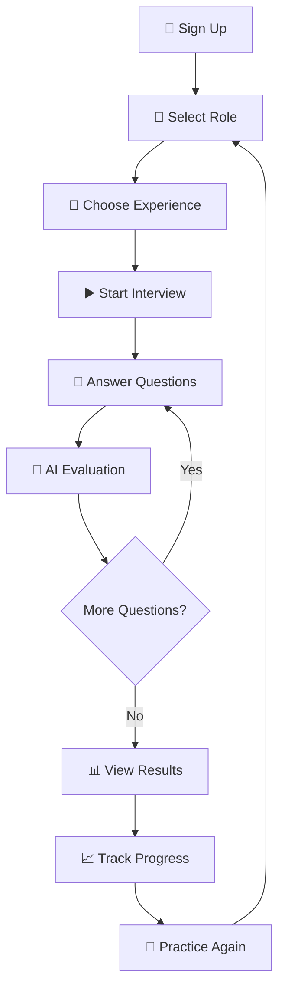

<div align="center">

# 🧠 SynapseAI

### *Connect to Your Career with AI-Powered Intelligence*

[](https://opensource.org/licenses/MIT)
[](https://nodejs.org/)
[](https://reactjs.org/)
[](https://www.mongodb.com/)
[](https://openai.com/)

**Master your interview skills with AI-powered mock interviews, real-time feedback, and intelligent analytics.**

[🚀 Get Started](#-installation) • [✨ Features](#-features) • [📖 Documentation](#-api-endpoints) • [🤝 Contributing](#-contributing)

---

</div>

## ✨ Features

<table>
<tr>
<td width="50%">

### 🎯 AI-Powered Interviews
```
✓ Dynamic question generation
✓ Real-time GPT-4 evaluation
✓ Comprehensive feedback
✓ Scenario-based questions
```

### 📊 Smart Analytics
```
✓ Progress tracking
✓ Performance metrics
✓ Strengths analysis
✓ Improvement insights
```

</td>
<td width="50%">

### 🎭 Multiple Interview Types
```
Frontend  → React, JS, CSS, UI/UX
Backend   → APIs, DB, System Design
HR        → Behavioral Questions
AI/ML     → Machine Learning, Data
```

### 📈 Adaptive Difficulty
```
🌱 Fresher    → 8 questions  (24 min)
💡 Junior     → 10 questions (30 min)
⚡ Mid-Level  → 10 questions (40 min)
🎯 Senior     → 12 questions (60 min)
🏆 Expert     → 15 questions (75 min)
```

</td>
</tr>
</table>

### 🔔 Additional Features

<div align="center">

| Feature | Description |
|---------|-------------|
| 🔐 **Secure Auth** | Google OAuth 2.0 + JWT tokens |
| 📅 **Schedule Interviews** | Plan your practice sessions |
| 🔔 **Smart Notifications** | Track progress & achievements |
| 📈 **Performance Charts** | Visualize your improvement |
| 🎨 **Modern UI** | Beautiful, responsive design |
| 🌙 **Dark Mode** | Easy on the eyes |

</div>

---

## 🚀 Tech Stack

<div align="center">



</div>

<table>
<tr>
<td width="33%" align="center">

### 🎨 Frontend


- **React 18** - UI Framework
- **Vite** - Build Tool
- **TailwindCSS** - Styling
- **Shadcn/ui** - Components
- **React Router** - Navigation
- **React Query** - Data Fetching

</td>
<td width="33%" align="center">

### ⚙️ Backend


- **Node.js** - Runtime
- **Express** - Web Framework
- **MongoDB** - Database
- **Mongoose** - ODM
- **OpenAI GPT-4** - AI Engine
- **Passport.js** - Auth

</td>
<td width="33%" align="center">

### 🔐 Security


- **Google OAuth 2.0** - SSO
- **JWT Tokens** - Sessions
- **Bcrypt** - Hashing
- **Helmet** - Security Headers
- **Rate Limiting** - DDoS Protection
- **CORS** - Cross-Origin

</td>
</tr>
</table>

---

## 📦 Installation

<div align="center">

### 📋 Prerequisites

| Requirement | Version | Download |
|------------|---------|----------|
| 🟢 Node.js | 18+ | [nodejs.org](https://nodejs.org/) |
| 🍃 MongoDB | 6.0+ | [mongodb.com](https://www.mongodb.com/) |
| 🤖 OpenAI API | GPT-4 | [platform.openai.com](https://platform.openai.com/) |
| 🔐 Google OAuth | 2.0 | [console.cloud.google.com](https://console.cloud.google.com/) |

</div>

### 🔽 1. Clone the Repository

```bash
# Clone the repository
git clone https://github.com/him4n-shu/SynapseAI.git

# Navigate to project directory
cd SynapseAI
```

### ⚙️ 2. Backend Setup

```bash
# Navigate to server directory
cd server

# Install dependencies
npm install

# Copy environment template
cp .env.example .env
```

**Configure `.env` file:**

```env
# MongoDB
MONGODB_URI=your_mongodb_connection_string

# OpenAI
OPENAI_API_KEY=your_openai_api_key
OPENAI_MODEL=gpt-4

# JWT
JWT_SECRET=your_jwt_secret
SESSION_SECRET=your_session_secret

# Google OAuth
GOOGLE_CLIENT_ID=your_google_client_id
GOOGLE_CLIENT_SECRET=your_google_client_secret
GOOGLE_CALLBACK_URL=http://localhost:5000/api/auth/google/callback

# Server
PORT=5000
NODE_ENV=development
CLIENT_URL=http://localhost:8080
```

**Start the backend server:**

```bash
# Development mode (with auto-restart)
npm run dev

# Production mode
npm start
```

### 🎨 3. Frontend Setup

```bash
# Navigate to frontend directory
cd ../frontend

# Install dependencies
npm install

# Copy environment template
cp .env.example .env
```

**Configure `.env` file:**

```env
VITE_API_URL=http://localhost:5000
VITE_GOOGLE_CLIENT_ID=your_google_client_id
```

**Start the frontend server:**

```bash
# Development mode
npm run dev

# Build for production
npm run build
```

<div align="center">

### 🎉 You're All Set!

Open [http://localhost:8080](http://localhost:8080) in your browser

</div>

---

## 🎮 Usage

<div align="center">



</div>

### 📝 Step-by-Step Guide

<table>
<tr>
<td width="50%">

#### 1️⃣ **Create Account**
- Sign up with email/password
- Or use Google OAuth
- Set your profile preferences

#### 2️⃣ **Select Interview Type**
- Choose from 4 roles
- Pick experience level (0-4)
- View estimated time

#### 3️⃣ **Start Practicing**
- Answer AI-generated questions
- Use voice or text input
- Get real-time timer

</td>
<td width="50%">

#### 4️⃣ **Receive Feedback**
- Instant AI evaluation
- Score out of 10
- Strengths & improvements

#### 5️⃣ **Track Progress**
- View detailed analytics
- Compare past interviews
- Identify patterns

#### 6️⃣ **Keep Improving**
- Schedule future interviews
- Review history
- Achieve milestones

</td>
</tr>
</table>

---

## 📊 Interview Configuration

<div align="center">

| Level | Badge | Questions | Time/Question | Total Time | Difficulty |
|-------|-------|-----------|---------------|------------|------------|
| **0** | 🌱 Fresher | 8 | 3 min | 24 min | ⭐ Easy |
| **1** | 💡 Junior | 10 | 3 min | 30 min | ⭐⭐ Moderate |
| **2** | ⚡ Mid-Level | 10 | 4 min | 40 min | ⭐⭐⭐ Intermediate |
| **3** | 🎯 Senior | 12 | 5 min | 60 min | ⭐⭐⭐⭐ Advanced |
| **4** | 🏆 Expert | 15 | 5 min | 75 min | ⭐⭐⭐⭐⭐ Expert |

### 🎨 Experience Level Features

```
🌱 Fresher    → Basic concepts, syntax, fundamentals
💡 Junior     → Practical implementation, core skills  
⚡ Mid-Level  → Advanced concepts, best practices
🎯 Senior     → System design, leadership, architecture
🏆 Expert     → Mastery, innovation, strategic thinking
```

</div>

---

## 🎨 Brand Identity

<div align="center">

### Color Palette

| Color | Hex | Usage |
|-------|-----|-------|
| 🔵 **Neon Cyan** | `#06b6d4` | Primary, Technology |
| 🟣 **Neon Purple** | `#a855f7` | Secondary, Creativity |
| 🟢 **Neon Lime** | `#84cc16` | Accent, Success |
| ⚫ **Dark** | `#0a0a0a` | Background |
| ⚪ **Light** | `#ffffff` | Text |

### Logo Design

```
    🔵 ← Neural nodes
   /  \
  🟣  🟢 ← Connections
   \ /
    🌈 ← Central AI
   / \
  🔵  🟣 ← Output
```

**Tagline:** *"Connect to Your Career"*

**Symbolism:** Neural network representing AI-powered learning and brain synapses

</div>

---

## 📸 Screenshots

<div align="center">

### 🏠 Landing Page
*Beautiful, modern interface with personalized welcome*

### 🎯 Interview Selection
*Choose your role and experience level*

### 💬 Live Interview
*AI-powered questions with real-time timer*

### 📊 Results Dashboard
*Detailed analytics and performance metrics*

### 📈 Progress Tracking
*Visualize your improvement over time*

> *Screenshots coming soon! 📷*

</div>

---

## 🛠️ Development

<div align="center">

### 🧪 Run Tests

```bash
# Backend tests
cd server && npm test

# Frontend tests
cd frontend && npm test

# Run all tests
npm run test:all
```

### 🏗️ Build for Production

```bash
# Build frontend
cd frontend && npm run build

# Start production server
cd server && npm start

# Or use PM2 for production
pm2 start server/index.js --name synapseai
```

### 🐛 Debug Mode

```bash
# Backend with debugging
cd server && npm run dev:debug

# Frontend with source maps
cd frontend && npm run dev -- --debug
```

</div>

---

## 📝 API Endpoints

<div align="center">

### 🔐 Authentication

| Method | Endpoint | Description | Auth |
|--------|----------|-------------|------|
| `POST` | `/api/auth/signup` | Create new account | ❌ |
| `POST` | `/api/auth/login` | Email/password login | ❌ |
| `GET` | `/api/auth/google` | Google OAuth login | ❌ |
| `POST` | `/api/auth/logout` | Logout user | ✅ |

### 🎯 Interview

| Method | Endpoint | Description | Auth |
|--------|----------|-------------|------|
| `POST` | `/api/interview/start` | Start new interview | ✅ |
| `POST` | `/api/interview/submit-answer` | Submit answer | ✅ |
| `POST` | `/api/interview/complete` | Complete interview | ✅ |
| `GET` | `/api/interview/history` | Get interview history | ✅ |
| `GET` | `/api/interview/results/:id` | Get results | ✅ |

### 👤 User

| Method | Endpoint | Description | Auth |
|--------|----------|-------------|------|
| `GET` | `/api/user/profile` | Get user profile | ✅ |
| `PUT` | `/api/user/profile` | Update profile | ✅ |
| `GET` | `/api/user/stats` | Get statistics | ✅ |

### 📅 Scheduled

| Method | Endpoint | Description | Auth |
|--------|----------|-------------|------|
| `GET` | `/api/scheduled` | Get scheduled interviews | ✅ |
| `POST` | `/api/scheduled` | Schedule interview | ✅ |
| `PUT` | `/api/scheduled/:id` | Update scheduled | ✅ |
| `DELETE` | `/api/scheduled/:id` | Delete scheduled | ✅ |

</div>

---

## 🤝 Contributing

<div align="center">

We love contributions! 🎉

### How to Contribute

```bash
# 1. Fork the repository
# 2. Create your feature branch
git checkout -b feature/AmazingFeature

# 3. Commit your changes
git commit -m 'Add some AmazingFeature'

# 4. Push to the branch
git push origin feature/AmazingFeature

# 5. Open a Pull Request
```

[](https://github.com/him4n-shu/SynapseAI/graphs/contributors)
[](https://github.com/him4n-shu/SynapseAI/issues)
[](https://github.com/him4n-shu/SynapseAI/pulls)

</div>

---

## 📄 License

<div align="center">

This project is licensed under the **MIT License**

[](https://opensource.org/licenses/MIT)

See [LICENSE](LICENSE) file for details

</div>

---

## 🙏 Acknowledgments

<div align="center">

Special thanks to these amazing technologies and services:

| Technology | Purpose |
|------------|---------|
| 🤖 **OpenAI** | GPT-4 API for AI evaluation |
| 🍃 **MongoDB** | Database infrastructure |
| 🔐 **Google** | OAuth authentication |
| ⚛️ **React** | Frontend framework |
| 🟢 **Node.js** | Backend runtime |
| 🎨 **Tailwind** | Styling framework |

</div>

---

## 📧 Contact & Support

<div align="center">

### Get in Touch

[](mailto:support@synapseai.com)
[](https://twitter.com/SynapseAI)
[](https://linkedin.com/company/synapseai)

### ⭐ Star Us on GitHub!

If you find SynapseAI helpful, please consider giving us a star ⭐

[](https://github.com/him4n-shu/SynapseAI/stargazers)

</div>

---

<div align="center">

### 🧠 Built with Intelligence by SynapseAI Team

**Connect to Your Career**

*Empowering job seekers with AI-powered interview preparation*

---

Made with ❤️ and 🤖 | © 2025 SynapseAI

</div>

